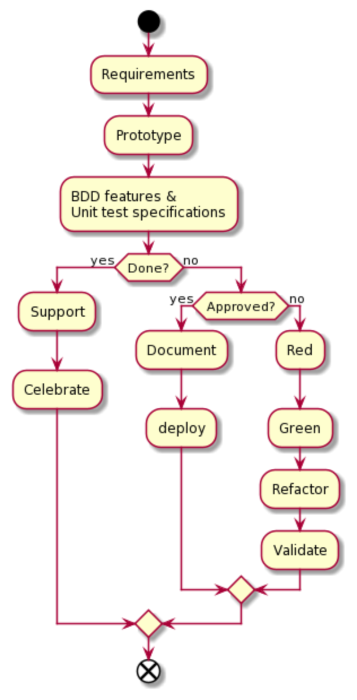
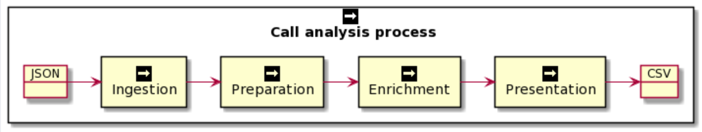
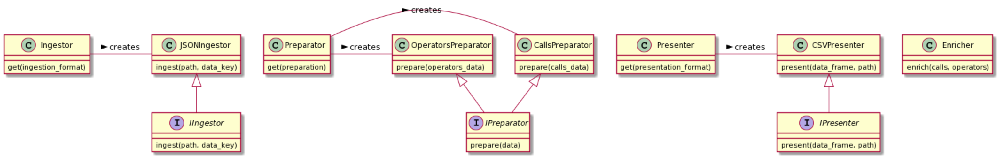

# archimedes-tech-test (Ernst van Graan)
## Introduction

This repo solves the challenge as detailed in [INSTRUCTIONS.md](INSTRUCTIONS.md)

## Process

The following design and implementation process was followed. I played the role of stakeholder for Validation, which in a team context comprises steps like code reviews, stakeholder demos, etc:



It should be noted that this is an iterative process eventually resulting in a functional set of modules.

First I create a quick and dirty prototype to accomplish all the important implementation aspects of the requirements, expose risks / design seams and inform ideas around testing.

Second, I translate requirements into BDD features and scenarios and / or unit test specifications. For this challenge unit test specifications were sufficient.

Third, I use the insight gained from the prototype to sketch out a design in test code, I.e. I structure tests such that they require the design I think will work for the solution and have the test specifications push back on that and help me refine the design. I also implement the test orchestration with all expectations according to the requirements.

Fourth, I follow red-green-refactor to implement the solution, driven by the tests and the design expressed there-in.

Fifth, I tie the modules together in a main application, service, etc. For this challenge this meant a small command-line application in python.

At each step producing an output a stakeholder can validate, I present the output to the stakeholder in the form of a demo.

Finally I do clean-up, documentation and move the test suite to a continuous integration environment. If the architecture allows for it (e.g. AWS amplify or well-established continuous deployment pipelines) I like to have the tests run in such pipelines as early as possible (ideally from step 2 already.)

## Call analysis



JSON input files are provided for calls and operators. These files are ingested, cleaned and prepared for enrichment. In this solution, enrichment consists of merging operators with calls using the operator regional prefix detected in the calls. An output data frame is then sorted and output to a CSV file.

## Solution design



It is always tricky to determine how much design to introduce in any given solution. It is easy to overdesign as well as underdesign. In many cases a solution with a limited purpose and lifetime may be sufficiently implemented using only a prototype. If the solution how-ever will find recurrent use or become a part of a larger suite of solutions, it needs to be well designed in order to limit failure demand and ongoing maintenance cost, as well as ease of use.

For this challenge I chose to have the solution open for extension. As such the design has interfaces for ingestion, preparation and presentation, and factory methods for creating ingestors, preparators and presenters.

The main application is very simple and can be easily extended to support other ingestion formate, preparators that act differently on the data sets and presenters that layout, format and export differently to different formats.

I stopped short of wiring in dependency injection and configuration to allow detection or specification of different such formats and the wiring in of their specific classes, as I would normally do that once the second use case has actually arrived. It is important though for the seams to be in place to make this easy to do when such features are requested.

This design then honors the single responsibility principle, as each component does one thing, it honors the open-closed principal as described above, as well as the liskov substitution principle, in that the interfaces allow ingestors, preparators and presenters to be substituted at will. Interface segregation was done along the seams as depicted in the design diagrams and the design worked out-of-the box, The design envisioned in the test specifications changed very little through implementation and did not present much resistance. The dependencies also point in the right direction, i.e. the interfaces specify what ingestors, preparators and presenters should offer and concrete implementations do not dictate.

## Usage

```
$ python3 -m venv venv
$ source venv/bin/activate
$ pip install -r requirements.txt
$ python3 src/analyze_calls.py --calls data/calls.json --operators data/operators.json --output data/output.csv
$ cat data/output.csv
```

## Testing

```
$ PYTHONPATH=src/ pytest --cov=.
```

## Style
Code style was checked using pycodestyle
```
$ pycodestyle --show-source --show-pep8 src
$ pycodestyle --show-source --show-pep8 tests
```
